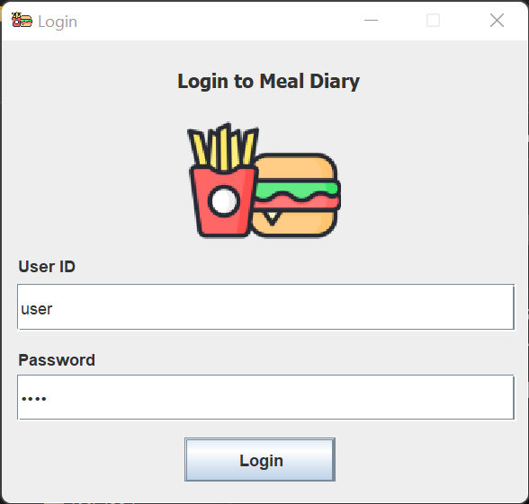
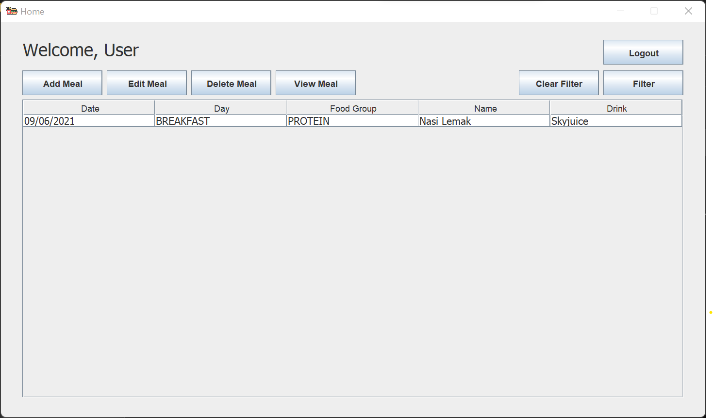
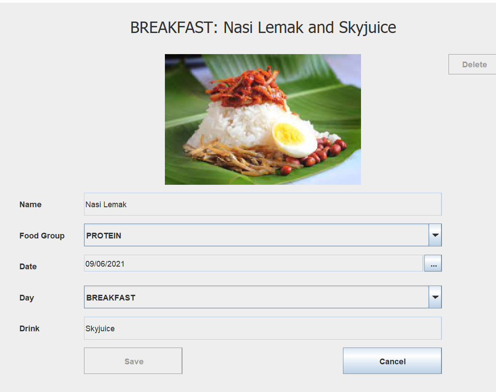

# Meal Planner 🍜

A simple meal planner made in Swing to demonstrate MVP architecture.

## Getting Started

On linux, execute this command to build and run:

```sh
javac -cp '.:./lib/*' Main.java && java -cp '.:./lib/*' Main && find . -type f -name '*.class' -delete
```

On windows, use this instead:
```sh
javac -cp .;./lib/* Main.java && java -cp .;./lib/* Main && del /s *.class
```

The default username and password are both `user` which can be found in database folder.

## Contributors
Special thanks to [Arzmin](https://github.com/jmn-exe) and [Willi](https://github.com/jasonderulo12345). 🦋

## Screenshots




## License
MIT
